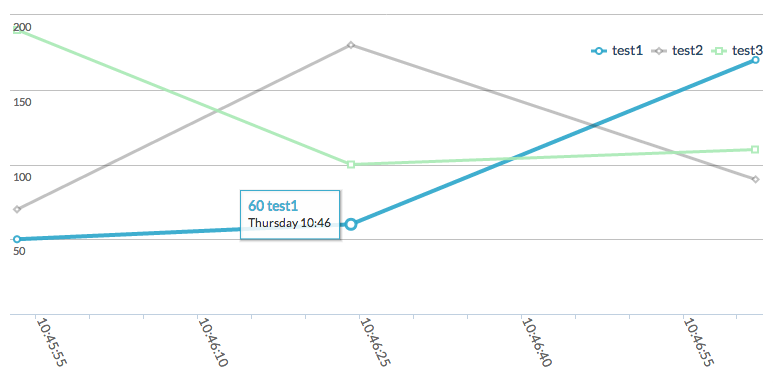
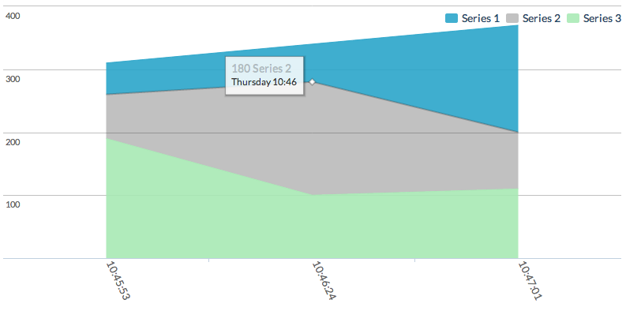
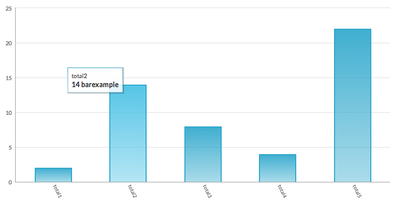
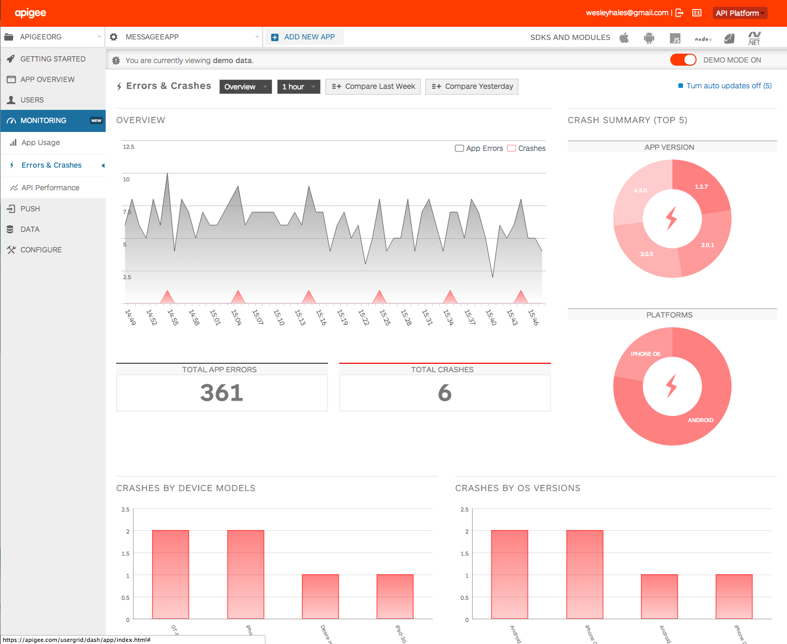

angular-charts
==============

This project is a chart directive and service written to make chart rendering easier. Currently it's using [Highcharts](http://highcharts.com)
as the charting library, but it would be easy to plug in others by providing an angular based service and directive for each library.

By including [highcharts.json](app/charts/highcharts.json), [chart-directive.js](app/charts/chart-directive.js), and [chart-service.js](app/charts/chart-service.js) in your Angular project, you can create the following charts with ease:

###Pie Chart
```html
<chart id="pieDemo"
       chartdata="pieChartData"
       type="pie" style="height:260px"
       titleicon="&hearts;"
       titlecolor="rgba(189,189,189,0.5)"
       titleimagetop="-6%"
       titleimageleft="-2%"></chart>
```
Will produce:


###Line (Timeseries) Chart
```html
<chart id="lineDemo"
       chartdata="lineChartData"
       type="line"
       xAxisLabel="return Highcharts.dateFormat('%H:%M:%S', this.value);"
       xAxisStep="3"></chart>
```
Will produce:



###Area Chart
```html
<chart id="areaDemo"
       chartdata="areaChartData"
       type="area"
       xAxisLabel="return Highcharts.dateFormat('%H:%M:%S', this.value);"></chart>
```
Will produce:



###Bar Chart
```html
<chart id="barDemo"
       chartdata="barChartData"
       type="column"></chart>
```
Will produce:



##Data Formatting

The JSON that will power your charts must be properly formatted. Every RESTful endpoint is different in how it delivers data 
to be displayed in charts. So your job is to create a controller like [page-controller.js](app/js/page-controller.js) and message the data (if needed).

Your data can be prepared in 2 possible formats. To display the bar chart example above, I'm using:
```javascript
var barChartData = [
        {label: 'total1', value: 2},
        {label: 'total2', value: 14},
        {label: 'total3', value: 8},
        {label: 'total4', value: 4},
        {label: 'total5', value: 22}
      ]
```
This is simply an array of objects with a label and value. This is the Array that we'll send to the chart service to
create the chart. But first we must create a description of the data so the service knows how to format along with 
what colors we'd like to use and any other specific details to make the chart look good.
```javascript
var dataDescription = {
        bar: {
          labels: ['barexample'],
          dataAttr: ['label', 'value'],
          colors: [createGradient('rgba(43,166,203,0.9)', 'rgba(43,166,203,0.4)')],
          borderColor: 'rgba(43,166,203,1)'
        }
      };
```
Note how I'm using ```dataAttr``` to descript the attributes of my JSON data. This allows you to pinpoint specific attributes in returned data.
***
Once you have the data for your chart and a description of how it should look, you can then send it to the service.
```javascript
$scope.barChartData = chartService.convertBarChart(barChartData, tempBarChart, dataDescription.bar);
```
The cool thing about having the barChartData object on the scope is that we can now repopulate it with new data at any time and the directive will 
automatically update the chart.

So if you want to refresh the charts on a timer every 30 seconds, then it's as easy as pulling new data and re-calling the service.

Another option is nested array in returned data. You may have an array of objects, but then another array within each object with the data you need.
For example, in the pieChartData object we have the following object structure:
```javascript
var lineChartData = [
        {
          label: 'test1',
          datapoints: [
            {
              timestamp: 1383230753238,
              count: 50
            },
            {
              timestamp: 1383230784165,
              count: 60
            },
            {
              timestamp: 1383230821680,
              count: 170
            }
          ]
        }
```
For the data description of this chart, we use:
```javascript
timeseries: {
          labels: ['Total'],
          dataAttr: ['label', ['timestamp', 'count']],
          detailDataAttr: ['count']...
```
Here, the label attribute is used for the label, then we use the timestamp and count to plot the values on the timeseries.

###Running the example
You'll need to have node installed to run the server (thanks angular-seed!)
Execute ```./web-server.js``` from the command line.
Then visit ```http://localhost:8001/app/index.html```

#Notes
There's still a ton of hardening to do and other charts to add. Ideas and pull requests are welcome.

This charting component originates from the monitoring section of the new [Apigee App Services platform](https://apigee.com/usergrid/dash/app/).
It is by far the coolest project I have written, and if you need to monitor HTML/Web, iOS, or Android mobile apps, there
is nothing around that beats it... and it's FREE! :)


